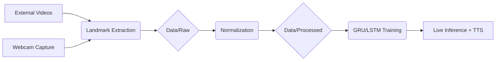

# ASL-TALK: Real-time Sign Language Recognition

**ASL-TALK** is a professional-grade real-time American Sign Language (ASL) recognition system. It leverages MediaPipe for hand landmark extraction and utilizes Deep Learning sequence models (LSTM/GRU) to predict gestures from live webcam feeds.

This project serves as a **portfolio piece** demonstrating:
* **End-to-end ML Pipeline**: From raw video ingestion to real-time deployment.
* **Modular Engineering**: Clean, scalable code architecture using YAML configurations.
* **Production Features**: Integrated Text-to-Speech (TTS) and multi-threaded inference.

---

## Key Tech Stack

* **Core**: Python 3.10+
* **Deep Learning**: PyTorch (Sequence Modeling)
* **Computer Vision**: MediaPipe, OpenCV
* **Data Engineering**: NumPy, YAML, JSONL
* **UI/UX**: Pyttsx3 (Text-to-Speech), Custom OpenCV Overlays

---

## Machine Learning Pipeline

The workflow is organized into automated, modular stages:



1. **Ingestion**: Supports ASL Citizen Dataset ([Kaggle](https://www.kaggle.com/datasets/abd0kamel/asl-citizen/code) ) and custom webcam recordings.
2. **Feature Engineering**: RGB Video → 21 Hand Landmarks → Normalized Coordinates.
3. **Preprocessing**: Automated `raw` → `interim` → `processed` (NPZ format) workflow.
4. **Training**: Sequence model training with performance tracking and checkpointing.
5. **Deployment**: Real-time inference with motion-aware state resetting.

> Note: You also can get my processed data (NPZ) on [HuggingFace](https://huggingface.co/datasets/LQB464/ASL_Landmarks) and put it in data/processed. After that, you can build your own src/models since my model.py is pretty bad.

---

## Project Structure

```text
ASL-TALK
│
├─ configs/          # YAML configs for Model, Train, and Inference
├─ data/             # Versioned data (raw, external, processed)
├─ models/           # Trained .pt checkpoints and hand_landmarker.task
├─ src/              
│  ├─ data/          # Scripts for collection and preprocessing
│  ├─ models/        # RNN architectures and training logic
│  └─ utils/         # Webcam, Hand Detector, Overlay, and TTS helpers
├─ pyproject.toml    # Dependencies and metadata
└─ README.md
```

---

## Installation

```bash
# Clone the repository
git clone https://github.com/lqb464/ASL-Recognizer-With-Mediapipe-And-TTS.git
cd ASL-Recognizer-With-Mediapipe-And-TTS

# Install in editable mode
pip install -r requirements.txt
```

---

## Usage Guide

### 1. Data Collection & Preprocessing
You can choose to collect your own data or import external datasets:

* **Capture via Webcam**:
    ```bash
    python -m scripts.build_dataset --collect-webcam
    ```
* **Build Dataset (Preprocessing)**:
    ```bash
    # Process all available sources (Default)
    python -m scripts.build_dataset --source all
    ```

### 2. Model Training
Configure your hyperparameters in `configs/train.yaml` and run:
```bash
python -m scripts.train_models
```

### 3. Real-time Inference
Launch the live recognition system with audio feedback:
```bash
python -m scripts.infer_webcam
```

---

## Configuration

All system behaviors are controlled through YAML files in the `configs/` directory:
* `data.yaml`: Path management and recording parameters.
* `model.yaml`: RNN architecture (GRU/LSTM, layers, hidden dims).
* `train.yaml`: Batch size, learning rate, and epochs.
* `inference.yaml`: Prediction smoothing and motion thresholds.